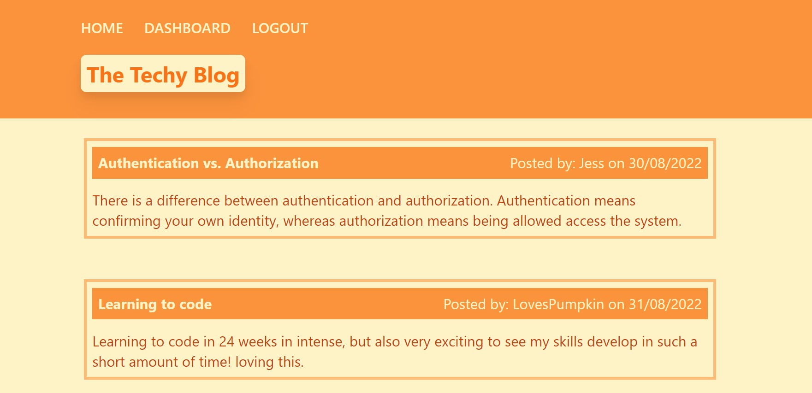

# 14-Model-View-Controller-MVC-Tech-Blog
## Description
A CMS-style blog site similar to a Wordpress site, where developers can publish their blog posts and comment on other developers’ posts as well.

## User story:
AS A developer who writes about tech
I WANT a CMS-style blog site
SO THAT I can publish articles, blog posts, and my thoughts and opinions

## User setup:
n/a 

## Screenshots:

## Links:

GitHub: https://github.com/NessJade96/14-Model-View-Controller-MVC-Tech-Blog
Heroku: 

## planning notes: 
1. Create homepage: existing blog posts, nav links (homepage / dashboard), and log in. This means creating links to the pages 
    -NAV
        -if signed in show "logout option" else show "login"
    -homepage
        -When clicked on it always takes you to the blogposts. 
        -shows a list of blog posts, 
            -if clicked on, then it opens a new page to show the blog post, you can add a comment
    -signin (click login button)
    -signup (click signup instead option under login button)
    -dashboard (click the dashboard button in nav)
        -Only get taken here if logged in, else go to login page. 
        -shows your blogposts 
            -click on blog post to edit
            -give options to add more -> go to Create New Post page

## Commit notes:

1. Setup folders structure with files and set up the readme.

2. Mock HTML set up for tailwind css and page layout planning, all pages. 

3. Added in the comment html text that was missing in the last commit. 

4. Moving the html into seperate html pages (still mock ups for handlebars.)

5. Created the users in the MVC, started on comments and blog_posts. Able to load the homepage on the local server through the browser - all styling applied. 

6. Adding in the Post routes, and changing the commentRoutes to reflect users commenting. 

7. Creating the homeRoutes to navigate through the application. Seeded the database

8. Changed some of the get routes as they weren't loading the content correctly, and updated JS files to 'update post'

9. Changed models/index.js where I was linking the wrong foreign key. 

10. Removed the withAuth from the /homepage routes. Changed the route for  commentBlog, now this navigates and displays the content. I also changed some handlebars styling for the user comments. Users can now create new posts through newPost.js. 

11. Removed my mock html pages, on the signup page I added the 'name' section as that was required for seeding the database when signing up. Added in some restrictions on the cookies. 
